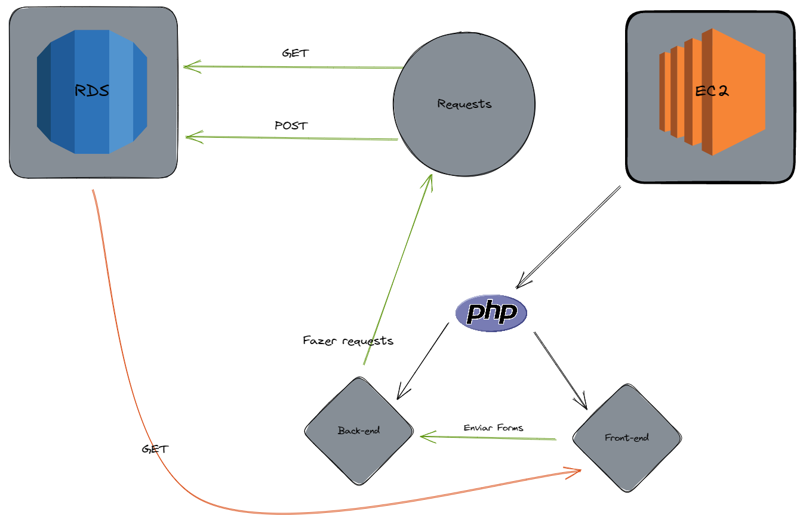

# atv-aws

Este repósitório contém um script desenvolvido com base no tutorial
<a href="https://docs.aws.amazon.com/AmazonRDS/latest/UserGuide/TUT_WebAppWithRDS.html">Create a web server and an Amazon RDS DB instance</a> da AWS

##features implementadas:
- Conexão com banco de dados em uma rds
- Codigo front/back end que realisa operações de create e read no database

##Demonstração
<a href="https://www.youtube.com/watch?v=GqaTcXlD8z4&ab_channel=LPHBackspace">Link do video demonstrativo</a>